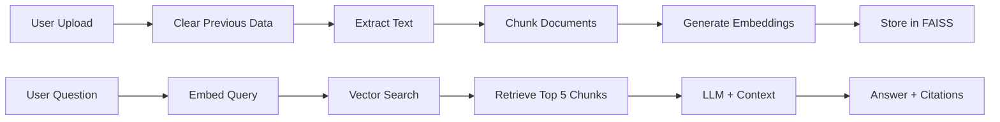

<div align="center">

# 📄 DocuMind

### AI-Powered Document Intelligence Platform

*Chat with your documents and websites using advanced RAG technology*

[](https://www.python.org/downloads/)
[](https://fastapi.tiangolo.com/)
[](https://openai.com/)
[](LICENSE)

[Features](#-features) • [Demo](#-demo) • [Quick Start](#-quick-start) • [Architecture](#-architecture) • [API](#-api-endpoints)

</div>

---

## ✨ Features

### 🎯 Core Capabilities
- **📤 Multi-Source Ingestion** - Upload PDFs or crawl entire websites
- **🧠 Smart Q&A** - Ask natural language questions about your content
- **📍 Source Citations** - Every answer includes exact page numbers and excerpts
- **🔄 Auto-Clear** - Fresh start with each upload (no data leakage)
- **⚡ Real-time Processing** - In-memory PDF handling for speed
- **🌐 Web Crawling** - Index up to 30 pages from any website

### 🔒 Smart & Secure
- **Context-Aware** - Knows current date for accurate calculations
- **No Hallucinations** - Only answers from your documents
- **Rate Limiting** - Max 30 pages per crawl to control costs
- **Temporary Storage** - PDFs processed in-memory, not saved

---

## 🎬 Demo

### Upload & Chat
```
1. Upload a PDF or enter a URL
2. Ask: "What is this document about?"
3. Get instant answers with source citations
```

### Example Queries
- 📊 "Summarize the key findings"
- 📅 "How much experience does this person have?" (for resumes)
- 🔍 "What are the main technical requirements?"
- 💡 "Explain the methodology used"

---

## 🚀 Quick Start

### Prerequisites
- Python 3.11+
- OpenAI API key ([Get one here](https://platform.openai.com/api-keys))

### Installation

**1. Clone the repository**
```bash
git clone https://github.com/yourusername/DocuMind.git
cd DocuMind
```

**2. Set up environment**
```bash
# Create virtual environment
python -m venv venv

# Activate (Windows)
venv\Scripts\activate

# Activate (Mac/Linux)
source venv/bin/activate
```

**3. Install dependencies**
```bash
pip install -r requirements.txt
```

**4. Configure OpenAI API**

Create a `.env` file in the project root:
```env
OPENAI_API_KEY=sk-your-api-key-here
```

**5. Run the application**
```bash
# From project root (DocuMind/)
uvicorn backend.main:app --reload
```

**6. Open in browser**
```
http://localhost:8000
```

---

## 🏗️ Architecture

### Tech Stack

| Component | Technology | Purpose |
|-----------|------------|----------|
| **Backend** | FastAPI | High-performance async API |
| **LLM** | GPT-4o-mini | Question answering |
| **Embeddings** | text-embedding-ada-002 | Document vectorization |
| **Vector DB** | FAISS | Similarity search |
| **Orchestration** | LangChain | RAG pipeline |
| **Frontend** | HTML/CSS/JS | Modern UI |
| **PDF Processing** | PyPDF | Document parsing |
| **Web Crawling** | Custom crawler | Website content extraction |

### System Flow



### RAG Pipeline

```
┌─────────────────────────────────────────────────────────┐
│                    User Question                        │
└────────────────────┬────────────────────────────────────┘
                     ↓
              [Embed Query]
                     ↓
         ┌───────────────────────┐
         │   FAISS Vector DB     │
         │  (Similarity Search)  │
         └───────────┬───────────┘
                     ↓
         Top 5 Relevant Chunks
                     ↓
         ┌───────────────────────┐
         │  GPT-4o-mini + Date   │
         │  + Retrieved Context  │
         └───────────┬───────────┘
                     ↓
         Answer + Source Citations
```

---

## 📁 Project Structure

```
DocuMind/
├── backend/
│   ├── __init__.py          # Package initializer
│   ├── main.py              # FastAPI app & routes
│   ├── ingest.py            # Document processing pipeline
│   ├── chat_service.py      # RAG Q&A logic
│   ├── rag_pipeline.py      # FAISS loader
│   ├── crawler.py           # Web scraping utility
│   ├── templates/
│   │   └── index.html       # Frontend UI
│   ├── static/
│   │   └── styles.css       # Modern styling
│   └── faiss_db/            # Vector store (auto-created)
├── .env                     # API keys (create this)
├── requirements.txt         # Python dependencies
└── README.md               # You are here!
```

---

## 🎯 API Endpoints

### `POST /upload`
Upload and index a PDF document
```json
{
  "file": "<PDF file>"
}
```

### `POST /ingest-url`
Crawl and index a website
```json
{
  "url": "https://example.com",
  "max_child_urls": 30
}
```

### `POST /chat`
Ask a question about indexed content
```json
{
  "question": "What is this document about?"
}
```

**Response:**
```json
{
  "answer": "This document discusses...",
  "sources": [
    {
      "source": "document.pdf",
      "page": 1,
      "excerpt": "Relevant text excerpt..."
    }
  ]
}
```

---

## ⚙️ Configuration

### Environment Variables

| Variable | Description | Required |
|----------|-------------|----------|
| `OPENAI_API_KEY` | Your OpenAI API key | ✅ Yes |

### Customization

**Adjust chunk size** (in `ingest.py`):
```python
RecursiveCharacterTextSplitter(
    chunk_size=1000,      # Increase for longer context
    chunk_overlap=200,    # Overlap between chunks
)
```

**Change retrieval count** (in `chat_service.py`):
```python
retriever = vectorstore.as_retriever(search_kwargs={"k": 5})  # Top 5 chunks
```

**Modify max crawl pages** (in `main.py`):
```python
max_allowed = 30  # Change to your preferred limit
```

---

## 🤝 Contributing

Contributions are welcome! Here's how:

1. Fork the repository
2. Create a feature branch (`git checkout -b feature/amazing-feature`)
3. Commit your changes (`git commit -m 'Add amazing feature'`)
4. Push to the branch (`git push origin feature/amazing-feature`)
5. Open a Pull Request

---

## 📝 License

This project is licensed under the MIT License - see the [LICENSE](LICENSE) file for details.

---

## 🙏 Acknowledgments

- [OpenAI](https://openai.com/) for GPT-4 and embeddings
- [LangChain](https://langchain.com/) for RAG orchestration
- [FastAPI](https://fastapi.tiangolo.com/) for the amazing framework
- [FAISS](https://github.com/facebookresearch/faiss) for vector search

---

<div align="center">

**Made with ❤️ by [Your Name]**

⭐ Star this repo if you find it helpful!

[Report Bug](https://github.com/yourusername/DocuMind/issues) • [Request Feature](https://github.com/yourusername/DocuMind/issues)

</div>